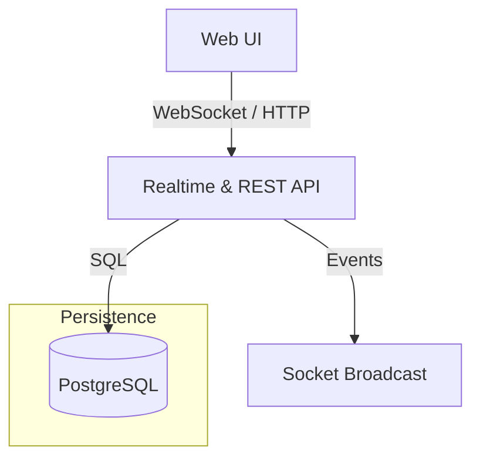

# Hacklumi Chat 💬🚀

A **modern, privacy‑respecting chat platform** built with **Next.js, Tailwind CSS, and TypeScript**. Hacklumi Chat delivers reliable 1‑to‑1 and group messaging, a sleek web experience, and a self‑contained deployment model that runs just as happily on a laptop as it does in the cloud.

---

## ✨ Key Features

| Category                | Highlights                                                                                                     |
| ----------------------- | -------------------------------------------------------------------------------------------------------------- |
| **Registration**        | Instant sign‑up with just a username and double‑entered password—no emails or external identity providers.     |
| **Contacts**            | Mutual contact lists: adding someone automatically sends a request they must accept. Remove contacts any time. |
| **Direct Chats**        | Persistent, searchable history for all 1‑to‑1 conversations with at‑least‑once delivery guarantees.            |
| **Group Chats**         | Up to **300** participants per room, with searchable history, owner‑managed member list, and graceful exit.    |
| **Media & Rich Text**   | Send images plus bold and _italic_ text with markdown‑style shortcuts.                                         |
| **Reactions**           | Leave emoji reactions on any message.                                                                          |
| **Contact Visibility**  | View profile cards for contacts you know or fellow chat participants.                                          |
| **Deep Links**          | Stable URLs that resolve to any user or group chat — perfect for bookmarks and sharing.                        |
| **Performance Tooling** | Built‑in load‑test utility to validate throughput targets (≤ 50 msg s⁻¹).                                      |

---

## 🧩 Architecture Overview

### High‑Level Flow

1. **Browser (Next.js front‑end)** establishes a WebSocket for real‑time delivery; falls back to long‑polling whenever WebSockets are blocked.
2. **Realtime Gateway (Node.js / Socket.IO)** processes commands, enforces security, and writes durable events.
3. **PostgreSQL** stores all domain entities (users, contacts, messages, groups) in ACID‑compliant tables.
4. **Search Index (PG full‑text)** enables fast lookup across conversations.



> _Mermaid diagrams render directly on GitHub._

### Reliability & Delivery Guarantees

- **At‑Least‑Once Delivery** – acknowledgements travel back to the sender once the server commits the message, ensuring no silent drops.
- **Crash‑Safe Storage** – WAL‑backed PostgreSQL with automatic recovery; chat records survive container restarts.
- **Reconnect Resume** – missed events are replayed after connectivity loss using incremental cursors.

### Scalability Targets

| Metric           | Design Target                                                          |
| ---------------- | ---------------------------------------------------------------------- |
| Concurrent users | 500 – 1 000                                                            |
| Write throughput | ≤ 50 messages s⁻¹ (aggregated)                                         |
| Group fan‑out    | Server relays each group post to all online members without duplicates |

These numbers fit comfortably inside one **AWS Fargate** task with headroom for spikes.

---

## 🛠️ Deployment Topology

### ☁️ Cloud (AWS Fargate)

```
+--------------------------+
|  Amazon ALB (HTTPS)      |
+-----------+--------------+
            | 80 / 443
+-----------v--------------+
|  Fargate Service (ECS)   |
|  • Next.js SSR & API     |
|  • Socket.IO Gateway     |
|  • Embedded PostgreSQL   |
+-----------+--------------+
            | 5432 (local only)
            +-------------------- (optional) EFS volume for PG data
```

_Why single‑container?_ Contest rules ask for an “all‑in‑one” image. In production you’d usually separate the database, but this setup simplifies demos while retaining durability through EFS‑backed volumes.

### 🐳 Local Development (docker‑compose)

- **`app` service** – same image used in Fargate, exposing ports **3000** (web) & **5432** (db).
- **Volume mounts** keep chat data and _node_modules_ between runs.

```bash
docker‑compose up --build
```

---

## 📂 Project Layout

```text
hacklumi-chat/
├── src/          # All application code (frontend & backend)
│   ├── components/
│   ├── pages/
│   ├── lib/
│   └── ...
├── deploy/          # Infrastructure‑as‑Code (AWS CDK / Terraform)
│   └── ...
├── scripts/         # Helper CLI & test utilities
│   └── perf-test.sh
└── README.md        # You are here
```

---

## ⚙️ Getting Started

1. **Prerequisites**

   - Docker & Docker Compose
   - Node ≥ 18 (if you want to run outside containers)

2. **Clone & Run Locally**

```bash
git clone https://github.com/your-org/hacklumi-chat.git
cd hacklumi-chat
docker‑compose up --build
```

3. **Open** `http://localhost:3000` in your browser, create an account, add a friend, and start chatting 😊

---

## 📆 Milestone Roadmap & Checklists

Each milestone is released as its own pull request and Git tag. Tick the boxes to track progress.

### M0 – Project Scaffold 🏗️

- [ ] `npx create-next-app@latest` with workspace layout and TS config
- [ ] ESLint, Prettier, and Husky pre‑commit hooks
- [ ] Vitest set up with a sample test
- [ ] GitHub Actions workflow: lint + test

### M1 – Bare‑Minimum Chat 🔤

- [ ] User registration form (username + password ×2)
- [ ] Password hashed with Argon2, stored in PostgreSQL
- [ ] JWT auth cookie issued on login
- [ ] `/chat/[user]` page with textarea & send button
- [ ] **POST** `/api/messages` persists message
- [ ] **GET** `/api/messages?peer=` long‑polls for new messages

### M2 – Contacts 🗂️

- [ ] Invite by username
- [ ] Accept / reject invitation workflow
- [ ] Contacts shown in sidebar sorted alphabetically

### M3 – Persistent History + Search 🔍

- [ ] Prisma migration adds `fts` column (PostgreSQL _tsvector_)
- [ ] **GET** `/api/search?q=` returns ranked matches
- [ ] Search bar on top of chat list with instant results

### M4 – WebSocket Realtime ⚡

- [ ] Upgrade long‑poll to WebSocket handshake
- [ ] In‑memory queue delivers message to connected peers
- [ ] Delivery **ACK** updates message status to _delivered_
- [ ] Fallback to polling when WebSocket unsupported

### M5 – Group Chats 👥

- [ ] `groups` table (`id`, `name`, `owner_id`)
- [ ] Endpoints to create, rename, and delete rooms
- [ ] Add / remove participants with owner approval
- [ ] Broadcast fan‑out to all members over WebSocket

### M6 – Images & Formatting 🖼️

- [ ] S3 bucket + presigned **PUT** for uploads
- [ ] Markdown parsing for **bold** / _italic_ / `code`
- [ ] `<Image>` component lazy‑loads thumbnails

### M7 – Deep Links 🔗

- [ ] Route `/u/[username]` focuses a DM
- [ ] Route `/g/[id]` opens group chat (auto‑join if invited)
- [ ] Graceful 404 page when target not found

### M8 – Reactions & Profiles 😄

- [ ] Hover a message → add emoji reaction (👍 😂 ❤️ etc.)
- [ ] Display reaction counters aggregated per emoji
- [ ] `/profile/[username]` sheet shows avatar, bio, shared groups

### M9 – Performance Harness 📊

- [ ] Locust script simulates 1 000 users at 50 msg s⁻¹
- [ ] Collect metrics via `pg_stat_statements` + Node cluster stats
- [ ] Grafana dashboard with CPU, memory, p99 latency

### M10 – Infrastructure & Deployment ☁️

- [ ] Dockerfile multi‑stage: build → runtime (Node 18‑slim + PostgreSQL 16‑alpine via _supervisord_)
- [ ] `docker‑compose.yml` exposes 3000 & 5432 volumes
- [ ] Terraform provisions: VPC, ALB, Fargate task, EFS, S3 bucket, IAM roles
- [ ] Makefile with `make deploy` & `make destroy` wrappers
- [ ] Readiness & liveness probes for health checks

---

## 🤝 Contributing

Pull requests are welcome — whether they fix a typo, craft a new feature, or push the performance envelope.  
File issues on GitHub or start a discussion if you have ideas!

---

## 📝 License

**MIT** — free to use, modify, and distribute.

_Made with ♥ and a shoestring budget._
